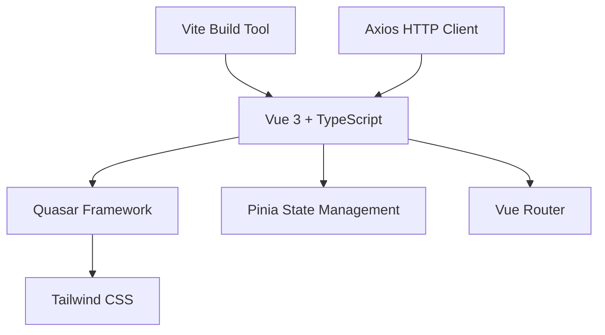

# What is Crackingo?

Crackingo is a cutting-edge AI-powered learning platform designed to revolutionize the way people learn and master new skills. Built with modern web technologies, it provides an interactive, gamified, and personalized learning experience that adapts to each user's unique learning style and pace.

## Key Features

### 🎯 **Interactive Learning Experience**
- **Dynamic Content Delivery**: Adaptive content that adjusts based on user performance
- **Real-time Feedback**: Instant feedback on quizzes and exercises
- **Multimedia Support**: Rich content including text, images, videos, and interactive elements
- **Code Snippet Integration**: Built-in syntax highlighting and code execution for programming courses

### 🤖 **AI-Powered Intelligence**
- **Personalized Learning Paths**: AI algorithms create customized learning journeys
- **Smart Recommendations**: Intelligent content suggestions based on user progress
- **Adaptive Difficulty**: Dynamic difficulty adjustment to maintain optimal challenge levels
- **Performance Analytics**: AI-driven insights into learning patterns and progress

### 🏆 **Gamification & Motivation**
- **Points & Rewards System**: Earn points for completing lessons and achieving milestones
- **Achievement Badges**: Unlock badges for various accomplishments
- **Leaderboards**: Compete with friends and other learners
- **Streak Tracking**: Maintain learning streaks for consistent progress
- **Progress Visualization**: Visual progress bars and completion statistics

### 📱 **Modern User Experience**
- **Responsive Design**: Seamless experience across desktop, tablet, and mobile devices
- **Offline Capabilities**: Continue learning even without an internet connection
- **Fast Performance**: Optimized for quick loading and smooth interactions
- **Accessibility**: WCAG compliant design for users with diverse needs

## Target Audience

### Students & Learners
- K-12 students preparing for exams
- University students supplementing their coursework
- Lifelong learners exploring new subjects
- Professionals seeking skill development

### Educators & Trainers
- Teachers creating interactive course content
- Corporate trainers developing employee programs
- Educational institutions implementing digital learning
- Tutors providing personalized instruction

### Organizations
- Companies training employees
- Educational institutions modernizing curricula
- Non-profits providing accessible education
- Government agencies offering public education

## Use Cases

::: tip Academic Learning
Perfect for supplementing traditional education with interactive exercises, practice quizzes, and adaptive learning paths.
:::

::: tip Professional Development
Ideal for corporate training, certification preparation, and skill enhancement programs.
:::

::: tip Personal Growth
Great for hobby learning, language acquisition, and exploring new interests at your own pace.
:::

::: tip Assessment & Testing
Comprehensive quiz system for evaluating knowledge and tracking progress over time.
:::

## Technology Stack

Crackingo is built using cutting-edge technologies to ensure optimal performance, maintainability, and user experience:

### Frontend Architecture

### Core Technologies
- **Vue 3**: Modern reactive framework with Composition API
- **TypeScript**: Type-safe development for better code quality
- **Quasar Framework**: Comprehensive UI component library
- **Pinia**: Intuitive state management solution
- **Tailwind CSS**: Utility-first CSS framework
- **Vite**: Fast build tool and development server

### Development Tools
- **ESLint + Prettier**: Code quality and formatting
- **Vitest**: Unit testing framework
- **Cypress**: End-to-end testing
- **GitHub Actions**: CI/CD pipeline
- **Husky**: Git hooks for quality gates

## Why Choose Crackingo?

### For Developers
- **Modern Architecture**: Built with latest technologies and best practices
- **Type Safety**: Full TypeScript support for better development experience
- **Component Library**: Reusable, well-documented components
- **API-First Design**: RESTful APIs with comprehensive documentation
- **Extensible**: Plugin architecture for custom functionality

### For Educators
- **Easy Content Creation**: Intuitive interface for creating courses and quizzes
- **Rich Analytics**: Detailed insights into student performance and engagement
- **Flexible Assessment**: Multiple question types and grading options
- **Scalable**: Supports small classrooms to large institutions

### For Learners
- **Personalized Experience**: AI-driven customization for optimal learning
- **Engaging Interface**: Gamified elements that make learning fun
- **Progress Tracking**: Clear visibility into learning achievements
- **Accessibility**: Designed to be inclusive and barrier-free

## Getting Started

Ready to dive into Crackingo? Here's how to get started:

1. **[Installation](/guide/installation)** - Set up your development environment
2. **[Quick Start](/guide/quick-start)** - Build your first learning module

## Community & Support

Join our growing community of developers, educators, and learners:

- 📚 **Documentation**: Comprehensive guides and API references
- 💬 **Community Forum**: Connect with other users and contributors
- 🐛 **Issue Tracker**: Report bugs and request features
- 📧 **Email Support**: Direct support for enterprise users
- 🎥 **Video Tutorials**: Step-by-step learning resources

---

*Ready to transform education with AI-powered learning? Let's build the future of education together!*